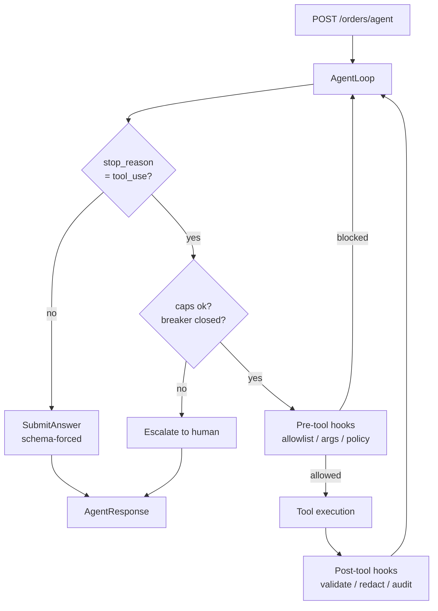

# Order Agent

A governed AI agent in Java Spring Boot. The model decides what to do; the
code decides what it's allowed to do.

---

## What this is

A Spring Boot service that exposes one endpoint. You send it a customer
request in plain English — an order status question, a refund request — and
it resolves the request by calling tools against the order system.

The model decides which tools to call and in what order. A governance layer
around the loop decides what it is allowed to do: argument validation,
policy caps, redaction, audit, and a circuit breaker, all enforced in Java
rather than in the prompt.

Two tools, an in-memory H2 database, and eight seeded orders. The domain is
deliberately small so the machinery around it is legible.

**Scope of the codebase:** an agent loop, a tool registry, a guardrail
interceptor chain, token and cost metering, and a record/replay test
harness. One agent, one endpoint. Multi-agent orchestration is on the
roadmap and deliberately not here — with two tools there is nothing worth
splitting.

---

## Architecture



**Request path.** A request arrives at `OrderAgentController` and goes
straight into `AgentLoop`: ask the model, and if it requests a tool, check
the caps and the breaker, run the guardrail chain, execute, run the
post-hooks, and ask again with the result. The loop ends when the model
stops requesting tools, or when a cap, a policy block or an open breaker
ends it early.

Every exit path produces the same `AgentResponse` envelope: status, data,
traceId, iterations, tokens, cost, terminationReason, modelUsed.

**Layering.** Standard Spring Boot — `controller` → `service` →
`repository`, with the AI concerns grouped under `service/agent`,
`service/governance` and `service/tool`. Entities never
leave the service layer. Tool input DTOs live in `dto/tool/` and double as
the JSON schema sent to the model, so one definition serves both the model
contract and the guardrail validation.

---

## What it is / what it isn't

| Is | Isn't |
|---|---|
| A backend service with one endpoint | A chatbot |
| A genuine agentic loop — step count is model-decided | A scripted pipeline with an LLM in it |
| Guardrails as code, tested | Guardrails as prompt instructions |
| Bounded cost per request | Unbounded autonomy |
| Escalation to human as a normal outcome | An agent that always answers |
| One agent, two tools | Multi-agent orchestration |

---

## Quickstart

```bash
export ANTHROPIC_API_KEY=sk-...
mvn clean verify          # runs the full suite offline, no API calls
mvn spring-boot:run
```

```bash
curl -X POST localhost:8080/orders/agent \
  -H 'Content-Type: application/json' \
  -d '{"request": "Where is order 1002?"}'
```

Requires Java 21+ (Spring AI 2.0 requires Spring Boot 4 / Framework 7).

One-time, optional: `git config core.hooksPath .githooks` enables a
pre-commit nudge (not a gate — `git commit --no-verify` skips it) that
flags a commit touching `service/agent`, `service/governance`, or
`service/tool` with no accompanying doc change. See
[`docs/adr/`](docs/adr/) and [`docs/llm-notes/`](docs/llm-notes/).

---

## The five things worth looking at

These are the demo scenarios. Each is a test, so each is verifiable.

**1. It's actually an agent**
"Refund order 1002 if it shipped late" requires the model to look up the
order, read the ship date, decide, then refund. Three tool calls
(`lookupOrder`, `issueRefund`, `submit_answer`), and the second is only
reachable because of what the first returned. Nobody wrote that sequence.
→ `curl -X POST localhost:8080/orders/agent -d '{"request": "Refund order 1002 if it shipped late."}'`
— or `mvn test -Dtest=AgentLoopGoldenTest` for the same shape (a
different, recorded scenario) with zero API calls.

**2. Policy holds when the model is wrong**
"Refund order 1002 for $5000" on a $120 order. The model may decide to
proceed. The pre-hook doesn't care.
→ `mvn test -Dtest=GuardrailPolicyTest`

**3. Policy holds when the model is manipulated**
Order 1007's notes field contains a prompt injection. The refund cap is
enforced in `PolicyInterceptor`, so the injection changes nothing.
→ `mvn test -Dtest=GuardrailInjectionTest`

**4. Failure is bounded**
With `orderagent.demo.fail-refund-tool=true`, the refund tool throws. After
three consecutive failures the breaker opens, the loop exits, and the
request returns `ESCALATED`. No infinite retry, no burned budget.
→ `mvn test -Dtest=CircuitBreakerTest`

**5. Tests run without an API key**
The whole suite replays recorded model responses from
`src/test/resources/cassettes/`. Same input, same assertions, no network,
no cost. The model call is the only non-deterministic part of the system,
so it's the part we record.
→ `unset ANTHROPIC_API_KEY && mvn clean verify`

---

## Concepts

Six concepts, each documented on its own: the problem it solves, the
mechanism, a guided walk through the code, **what it does not solve**, and a
command to see it run. Written to be read independently — start anywhere.

1. [Agentic loop](docs/concepts/01-agentic-loop.md) — why the step count is
   decided by the model, not by us
2. [Pre and post hooks](docs/concepts/02-pre-post-hooks.md) — policy in code,
   around every tool call
3. [Circuit breaker](docs/concepts/03-circuit-breaker.md) — escalate instead
   of retrying a dead dependency
4. [Schema-forced output](docs/concepts/04-schema-forced-output.md) — shape
   guaranteed, correctness not
5. [Prompt injection](docs/concepts/05-prompt-injection.md) — why
   prompt-level defence isn't enough
6. [Determinism](docs/concepts/06-determinism.md) — what is and isn't
   deterministic here

See also [docs/production-readiness.md](docs/production-readiness.md) — what
shipping this would actually require, and what deliberately doesn't exist
yet.

---

## Honest limits

- **Schema forcing guarantees shape, not truth.** A well-formed response can
  still be wrong.
- **Two tools and a shallow decision tree.** This is an agent at the simple
  end of the spectrum, deliberately. Unbounded autonomy over a refund API is
  how you end up in an incident review.
- **Determinism is bounded, not absolute.** The loop, caps, schemas and
  idempotency are deterministic. The model's choice within them is not.
  Record/replay makes tests deterministic; it doesn't make production so.
- **Prompt caching savings are measured on this workload.** Yours will differ.
- **H2 and seeded data.** Not a production persistence story.

---

## Stack

Java 21 · Spring Boot 4.0 · Spring AI 2.0.1 · Anthropic · Resilience4j ·
Micrometer · H2 · JUnit 5

Spring AI 2.0 removed the built-in tool-execution loop from every
`ChatModel`. This project drives the loop explicitly via `ToolCallingManager`
rather than using the auto-registered advisor — the control points are the
subject of this repository, so they're written out rather than delegated.

---

## Roadmap

Not built, deliberately. Each is a real next step, not a wish:

- **Shadow mode** — run alongside human handling, log what the agent would
  have done, act on nothing. The safe way to earn the right to act.
- **Multi-agent split** — role-scoped tool registries so an investigation
  path structurally cannot issue a refund. Worth doing when there are enough
  tools for the boundary to mean something.
- **Evaluation gate in CI** — a labelled request set with a regression
  threshold, so a prompt change that degrades accuracy fails the build.
- **Distributed breaker state** — the current counter is per-process.
